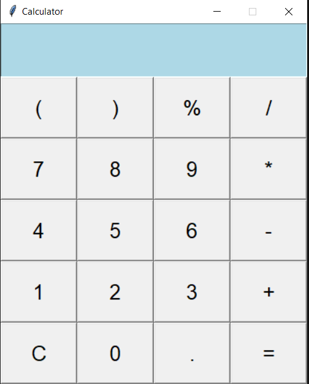

# **A Simple Python Calculator with Tkinter GUI**

BlueCalc is a basic calculator app built using Python's Tkinter library. It supports standard arithmetic operations with a clean graphical user interface (GUI). Great for beginners who want to learn about GUI development in Python!

 

---

## 🚀 **Features**

* Basic arithmetic operations: `+`, `-`, `*`, `/`, `%`
* Parentheses support for grouping
* Clear (`C`) button to reset input
* Handles invalid input gracefully with error messages
* Light blue themed entry box for a fresh look
* Extensible code structure (easy to add more features later)

---

## 📋 **Requirements**

* Python 3.x
* Tkinter (comes pre-installed with Python for most systems)

---

## 🎯 **Usage**

* Click on the buttons to input numbers and operators.
* Press `=` to calculate the result.
* Use `C` to clear the current input.
* Supports expressions like:
  `5 * (3 + 2) - 7 / 2`

